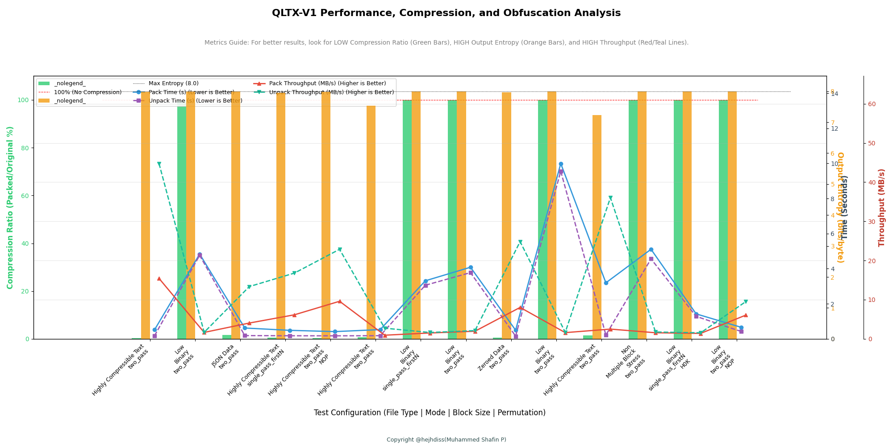

# Qeltrix Testing Proof-of-Concept

**Main Repository:** [Qeltrix](https://github.com/Qeltrix/Qeltrix)  
**Status:** Proof-of-Concept Testing Suite

## Important Note

This is a testing suite for a Proof-of-Concept (PoC) implementation. The PoC itself is at a very basic, foundational level - it is not even considered pre-development or a prototype. It exists solely to validate that the core concept is technically viable and worth pursuing further. This testing framework helps demonstrate that viability by measuring the fundamental characteristics of the approach.
**This subjects to this and otehr factors also:**
- Python's GIL.
- Python is slow, when compared to compiled language.
- PoC limitations.
- Not optimized,sice PoC is for proof of concept.
- very basic and  unoptimized - its PoC's limit.

## Power Under the Hood: Why This PoC Matters

While Qeltrix is currently at the Proof-of-Concept stage, this testing suite is designed to push its limits and demonstrate the power of its core features under stress.

This framework rigorously validates the implementation's adherence to critical engineering principles:

- **Integrity and Consistency:** Ensuring data packed and unpacked across various modes and block sizes is always identical to the original input
- **Performance and Scaling:** Measuring high throughput (MB/s) to validate efficiency, particularly the benefits of the parallel and streaming architecture
- **Obfuscation Quality:** Verifying that the final output approaches the theoretical maximum entropy (8.0 bits/byte), confirming strong security posture regardless of input data

## Overview

This repository contains the comprehensive integration and performance testing suite for the main `qeltrix.py` obfuscation container.

The goal is to systematically test Qeltrix across various:
- Input data types
- File sizes
- Operational modes (`two_pass` vs. `single_pass_firstN`)

Key metrics measured include:
- **Performance** (Speed/Throughput)
- **Compression Efficiency**
- **Obfuscation Quality** (Output Entropy)

The testing script generates a summary table and a detailed graph using Matplotlib to visualize the trade-offs between different Qeltrix configurations.

## Getting Started

### Prerequisites

- Python 3.x
- The `qeltrix.py` script must be available in the same directory as the testing script

### Required Libraries

Install dependencies using pip:

```bash
pip install lz4 numpy matplotlib cryptography
```

### Running the Tests

1. Ensure `qeltrix.py` and `test_qeltrix.py` are in the same folder
2. Execute the test script:

```bash
python test_qeltrix.py
```

The script will automatically:
- Create temporary dummy files
- Run pack/unpack commands
- Calculate metrics
- Generate output files

## Output Artifacts

After the script runs, the following files will be generated:

| Filename | Description |
|----------|-------------|
| `results_summary.txt` | A plain text, formatted table summarizing all test metrics (Entropy, Ratio, Time, Throughput) |
| `results_summary.json` | The raw, structured JSON data from all test runs |
| `qeltrix_test_results.png` | **Key visualization artifact.** A Matplotlib graph comparing all 4 critical metrics across the test configurations |

### Test Run Sample Output

This repository includes sample output files (e.g., `results_summary.txt`, `qeltrix_test_results.png`) generated during testing. These files are provided solely for reference to show the expected output format and typical performance characteristics.

**Sample Graph:**



*The graph above shows a sample test run, visualizing the trade-offs between entropy, compression ratio, throughput, and processing time across different configurations.*

## Qeltrix V1 Design Specifications

Even as a Proof-of-Concept, Qeltrix V1 operates under specific, intentional design choices that dictate how data is processed. This testing framework validates these decisions:

| Feature | Specification | Design Rationale |
|---------|--------------|------------------|
| **Magic Header** | `QLTX` (4 bytes) | Identifies the file format quickly |
| **Version** | 1 | Ensures backward compatibility for future versions |
| **Encryption** | ChaCha20-Poly1305 | Provides high-speed, authenticated encryption (AEAD) |
| **Key Derivation** | HKDF (HMAC-based Key Derivation Function) | Derives strong keys from content-derived seed material |
| **Data Flow** | Parallel Compression & Streaming Write | Minimizes memory usage and maximizes throughput |
| **Block Size** | User-configurable (stored in header) | Allows balancing I/O latency, compression ratio, and internal parallelism |
| **Permutation** | Deterministic Index Permutation | Adds an extra layer of structural obfuscation to prevent simple block-level analysis |

## Interpreting the Results Graph

The generated graph visualizes the core trade-offs of the Qeltrix implementation. "Better" is defined based on your primary goal: **Performance** or **Security**.

### 1. Obfuscation & Security (Output Entropy)

| Metric | Target | Indication | Graph Element |
|--------|--------|------------|---------------|
| Output Entropy (bits/byte) | **High** (Closest to 8.0) | The data is highly randomized, making it secure and resistant to pattern analysis | Orange Bar |
| Input Entropy | Baseline | Original randomness (not plotted, but in table) | (Table Only) |
| Max Entropy Ref. | 8.0 | The theoretical maximum randomness | Black Dotted Line |

### 2. Performance (Speed)

| Metric | Target | Indication | Graph Element |
|--------|--------|------------|---------------|
| Pack Throughput (MB/s) | **High** | Faster processing speed for the packaging operation | Red Line |
| Unpack Throughput (MB/s) | **High** | Faster processing speed for the retrieval operation | Teal Dashed Line |
| Pack Time (s) | **Low** | Raw time taken to pack | Blue Line |
| Unpack Time (s) | **Low** | Raw time taken to unpack | Purple Dashed Line |

### 3. Compression Efficiency

| Metric | Target | Indication | Graph Element |
|--------|--------|------------|---------------|
| Compression Ratio (%) | **Low** | The final `.qltx` file is much smaller than the original input file | Green Bar |
| No Compression Ref. | 100% | The packed file is the same size or larger than the input | Red Dashed Line |

## Test Configurations

The script runs a hard-coded set of stress tests designed to cover various edge cases:

- **File Types:** Highly Compressible Text, Low Compressibility Binary, JSON Data, Zeroed Data, Empty files
- **Modes:** `two_pass` (more secure/random, but slower) vs. `single_pass_firstN` (faster, key derived from a limited head portion)
- **Permutation:** Testing the impact of block-index permutation (`--no-permute` flag)
- **Block Sizes:** Testing large (2MB) down to very small (16KB) blocks to measure I/O overhead
- **Boundary Cases:** Testing non-multiple block sizes and minimal key derivation head bytes

## License

The Qeltrix project, including the main `qeltrix.py` script and the testing suite (`test_qeltrix.py`), is licensed under the **GNU General Public License v3.0 (GPLv3)**.

## Copyright

Copyright © [@hejhdiss](https://github.com/hejhdiss) (Muhammed Shafin P)  
All rights reserved.

---

**Note:** This is a Proof-of-Concept. Use at your own discretion and always validate results for your specific use case.
